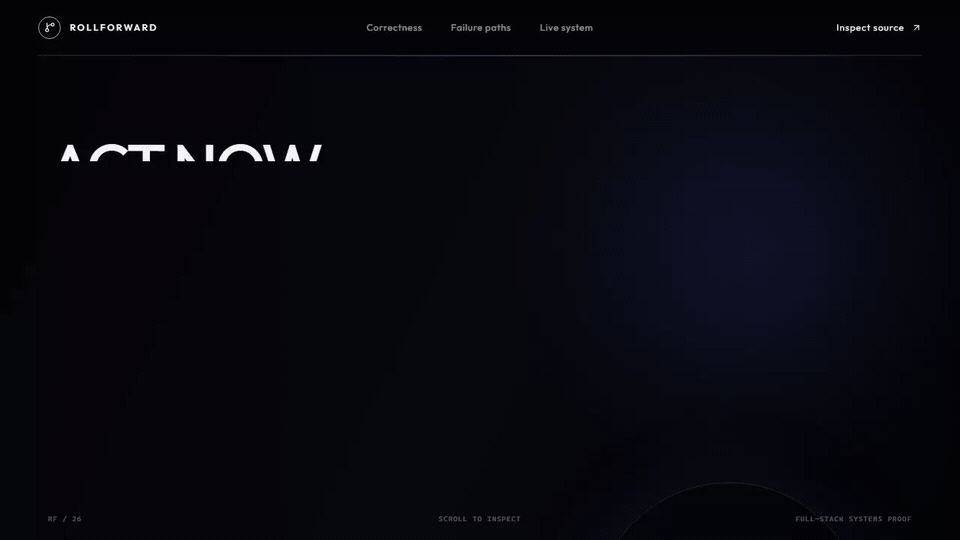
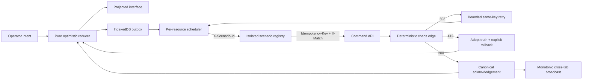

<div align="center">

# ROLLFORWARD

### Act now. Reconcile truth later.

**A full-stack optimistic release engine designed to stay honest when the network is not.**

[](https://github.com/ReaperXD67/rollforward-optimistic-engine/actions/workflows/ci.yml)


</div>



<div align="center"><sub>Actual browser capture. One click triggers a real API write, injected 503, bounded retry, and canonical acknowledgement.</sub></div>

## The assessment target

This is the recommended submission for Anzibloom’s **Full-stack Engineer — Optimistic interface coding** assessment. It concentrates the reviewer signal into one system: interface behavior, optimistic state, API design, concurrency control, failure recovery, and technical judgment are all observable in the same action.

This is not a dashboard mockup. The command deck is attached to a real Express API and a deterministic network edge. The hero’s **Run the failure path** button executes the same reducer, scheduler, retry policy, and server contract covered by the tests.

## The 90-second proof

1. Press **Run the failure path** in the hero.
2. Watch projected state advance before the request settles.
3. Enter the command deck and observe `503 → retry_wait → same-key retry → server v5`.
4. Switch to **Contention** and issue three writes: independent resources run concurrently while stale versions become explicit `412` rollbacks.
5. Go **Offline**, mutate Atlas, reload, and watch the IndexedDB outbox recover the original intent.
6. Export the mutation transcript, then challenge the implementation in [`DECISIONS.md`](./DECISIONS.md).

## What a reviewer can verify

| Reviewer question | Executable answer |
| --- | --- |
| Does the UI really update optimistically? | Confirmed state and projected state are separate; a pure reducer derives every optimistic frame. |
| Can retries duplicate an effect? | Stable UUID + payload fingerprint + in-flight coalescing + settled-result replay. |
| Can stale clients overwrite newer truth? | Every write carries `If-Match`; mismatches return typed `412` problems with the latest resource. |
| Does intent survive interruption? | Unsettled commands are transactionally persisted in IndexedDB and restored with the same key. |
| Can one resource block all work? | The scheduler serializes within a resource and runs independent resources concurrently. |
| Can tabs rewind each other? | `BroadcastChannel` propagates acknowledgements; the reducer accepts only strictly newer versions. |
| Can reset lose a race? | Client epochs and server generations fence responses from the obsolete scenario. |
| Will public reviewers corrupt each other’s demo? | A bounded LRU/TTL registry isolates the canonical store, chaos profile, and idempotency ledger per browser scenario. |
| Are the failure claims reproducible? | Seeded chaos is keyed by semantic scenario coordinates and attempt number; UI and test runs agree. |

## One intent, two realities



The central rule is deliberately boring and difficult to break:

```text
projected UI = latest confirmed state + active local intent
```

Canonical data is never mutated to fake responsiveness. Rollback changes the command’s status; the next render falls naturally out of the projection.

## Failure is a first-class state

| Condition | Visible behavior | Recovery contract |
| --- | --- | --- |
| Slow acknowledgement | Intent remains projected and transport stays observable | Wait without freezing the interface |
| Retryable `503` | Projection survives; attempt count advances | Bounded exponential backoff with the original key |
| Version conflict `412` | Latest server truth replaces the stale base | Settle ambiguous intent as rolled back |
| Offline + reload | Intent remains in the local mutation ledger | Restore as queued and resend when connected |
| Concurrent duplicate | Both callers receive one canonical result | Coalesce in flight or replay the stored result |
| Reset during flight | Old response is rejected at the scenario boundary | Client epoch + server generation fence |

## Run it

Requires Node.js 24+.

```bash
npm install
npm run dev
```

- Product: `http://localhost:5173`
- API: `http://localhost:8787`
- Readiness: `http://localhost:8787/healthz`

## Prove it

```bash
npm run check
npx playwright install chromium
npm run test:e2e
```

The current evidence is **38 deterministic unit/integration tests + 7 real-browser journeys**. The browser suite exercises the guided failure path, optimistic convergence, IndexedDB reload recovery, explicit conflicts, cross-tab propagation, responsive overflow, reduced motion, and axe-core accessibility at desktop and mobile widths.

GitHub Actions repeats the locked install, high-severity dependency audit, source verification, production builds, Chromium installation, and browser suite on every push.

## Production-shaped delivery

The repository ships one deployable artifact: Express serves the compiled React client and the command API from the same origin. That keeps the content-security policy strict and the browser/API contract simple.

- Multi-stage, non-root [`Dockerfile`](./Dockerfile)
- Declarative Singapore-region [`render.yaml`](./render.yaml)
- HTTP readiness check at `/healthz`
- `SIGTERM`/`SIGINT` request draining for zero-downtime replacement
- Bounded public-demo state: 256 browser scenarios, 30-minute idle TTL, 512 replay records per scenario
- No external fonts, stock media, analytics, cookies, or secrets

The scenario registry is intentionally process-local. A real multi-node product would move canonical state and idempotency records into a transactional shared store; this demo does not disguise that boundary.

## Repository map

| Concern | Start here |
| --- | --- |
| Product and scope | [`PRODUCT.md`](./PRODUCT.md) |
| Decisions and alternatives | [`DECISIONS.md`](./DECISIONS.md) |
| Correctness invariants | [`docs/ARCHITECTURE.md`](./docs/ARCHITECTURE.md) |
| 90-second review path | [`docs/REVIEWER_GUIDE.md`](./docs/REVIEWER_GUIDE.md) |
| Threat model and non-goals | [`docs/THREAT_MODEL.md`](./docs/THREAT_MODEL.md) |
| Optimistic decision core | [`src/domain/engine.ts`](./src/domain/engine.ts) |
| API/idempotency boundary | [`server/app.ts`](./server/app.ts) |
| Public scenario isolation | [`server/session-registry.ts`](./server/session-registry.ts) |
| Adversarial browser evidence | [`e2e/rollforward.spec.ts`](./e2e/rollforward.spec.ts) |

## Scope honesty

The private timed starter package was not accessed or redistributed. This independent proof-of-skill was built from Anzibloom’s public role description so the technical approach can be reviewed before any official timed attempt.

OpenAI Codex materially assisted with research, implementation, testing, visual review, and documentation. The candidate remains responsible for understanding and defending every submitted decision; the disclosure is repeated in [`DECISIONS.md`](./DECISIONS.md).
