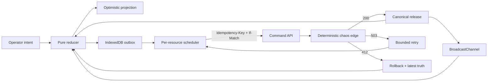

# Architecture and correctness model

ROLLFORWARD is built around a small pure decision core. Transport, persistence, cross-tab delivery, and motion are adapters. The split makes timing-dependent behavior reproducible in tests without turning the interface into a mock.



## Three layers of state

- **Confirmed:** the latest server-acknowledged version of each release.
- **Mutation journal:** immutable operator commands plus transport state and attempts.
- **Projected:** confirmed releases folded through only active local commands.

The projected layer is derived, never stored. Rollback therefore means changing a mutation's status, not reconstructing an earlier UI snapshot.

## Invariants and evidence

| ID | Invariant | Mechanism | Executable evidence |
| --- | --- | --- | --- |
| I-01 | Speculation never mutates confirmed truth | Projection fold over copied releases | reducer projection test |
| I-02 | At most one write per resource is in flight | Per-resource causal scheduler | same-resource scheduler test |
| I-03 | Independent resources may progress concurrently | Scheduler selects up to three unique resource IDs | multi-resource scheduler test |
| I-04 | Retried and concurrent duplicate commands are safe | Stable key, request fingerprint, in-flight coalescing, replay cache | API replay/coalescing tests |
| I-05 | A stale client cannot silently overwrite truth | `If-Match` version precondition | API conflict test |
| I-06 | Ambiguous conflicts are not auto-reapplied | Conflict becomes settled and adopts latest truth | reducer rollback test |
| I-07 | Interrupted work survives reload | IndexedDB active-mutation journal | outbox round-trip test |
| I-08 | Cross-tab delivery cannot rewind state | Strictly monotonic version merge | reducer merge test |
| I-09 | Curated chaos can be replayed exactly without cross-tab ID collisions | Tab-scoped UUIDs and semantic, attempt-sensitive chaos coordinates | identity and chaos tests |
| I-10 | Reset is a causal boundary | Client epoch and server generation fence | reset race test |

## HTTP command contract

```http
POST /api/releases/release-1/commands
Idempotency-Key: 15a1...c901
If-Match: "7"
X-Mutation-Attempt: 2
Content-Type: application/json

{
  "id": "15a1...c901",
  "releaseId": "release-1",
  "type": "set_progress",
  "payload": { "progress": 70 },
  "actor": "Aman Kumar",
  "createdAt": "2026-09-03T12:00:00.000Z",
  "scenarioSequence": 4
}
```

The key must equal the command ID. A successful replay returns the original accepted result. A stale version returns `412` with the latest canonical resource; retryable transport failures return a typed `503` problem.

## Failure policy

| Condition | Projection | Recovery |
| --- | --- | --- |
| Latency | Keep intent visible | Wait for acknowledgement |
| Retryable `503` | Keep intent visible | Bounded exponential backoff, same key |
| Version conflict `412` | Roll back ambiguous intent | Adopt latest truth and require a new decision |
| Offline | Queue intent locally | Persist until transport resumes |
| Reload during write | Restore as queued | Resend with the original key |

## Deliberate non-goals

This is a focused local assessment artifact, not a pretend production platform. It does not include identity, tenancy, a durable distributed idempotency store, automatic semantic conflict merging, or a WebSocket service. A production extension would place the same command contract behind authenticated tenant authorization, a transactional database, a shared idempotency index, rate limits, and durable event delivery.
